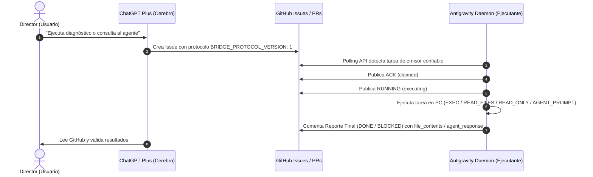

# Inverse Bridge Daemon (`/inv_chatgpt`) — V1.3

Plano de control Machine-to-Machine (M2M) seguro, auditable y desacoplado entre **ChatGPT Plus** (Cerebro) y **Antigravity** (Ejecutante local & Agente Cognitivo) mediante GitHub Issues y Pull Requests.

---

## 🏛️ Arquitectura y Modos de Operación



### 📋 Modos Soportados (`MODE`):
1. **`EXEC`**: Ejecución de comandos reales en lista ordenada con `cwd=TARGET` y `shell=False` (prevención de shell injection).
2. **`READ_FILES`**: Lectura segura de archivos autorizados con volcado estructurado en `file_contents` (`path`, `truncated`, `content`).
3. **`READ_ONLY`**: Diagnósticos estrictos restringidos por allowlist (`git status`, `git diff`, `git log`, `python --version`, `dir`, `ls`, etc.).
4. **`AGENT_PROMPT`**: Consultas cognitivas al agente a través de la capa desacoplada `agent_backend` (fail-closed `BLOCKED` por defecto).
5. **`IMPLEMENT_AND_TEST`**: Modo de verificación de entorno y tests.

---

## 🔒 Reglas de Seguridad Blindadas

1. **Autenticación del Emisor (`trusted_issue_authors`):** Solo procesa issues creados por autores autorizados (`["mromerolobos-bot"]`). Issues externos son ignorados silenciosamente.
2. **Named Mutex Global de Windows (`Local\AntigravityInverseBridge_SingleInstance_Mutex`):** Imposibilita la ejecución simultánea de múltiples instancias a nivel de sistema operativo.
3. **Redacción de Secretos:** Filtra automáticamente tokens (`ANTIGRAVITY_GITHUB_TOKEN`, `ghp_*`, `github_pat_*`), claves y credenciales.
4. **Restricción de Rutas (`allowed_roots`):** Acceso acotado a directorios autorizados.
5. **Bloqueo Destructivo:** Comandos de borrado recursivo requieren `DESTRUCTIVE_APPROVED: true`.
6. **Desacoplamiento Cognitivo:** `agent_backend` desconectado por defecto para evitar llamadas o consumo no autorizado.

---

## ⚙️ Configuración (`config.json`)

```json
{
  "repo": "mromerolobos-bot/co_escritor_ia",
  "poll_seconds": 10,
  "agent_role": "ANTIGRAVITY",
  "trusted_issue_authors": [
    "mromerolobos-bot"
  ],
  "allowed_roots": [
    "C:\\pinokio\\api\\cinematic-character-studio-v1-1",
    "C:\\Users\\Chelowolf"
  ],
  "agent_backend": {
    "enabled": false,
    "type": "none",
    "timeout_seconds": 60,
    "max_prompt_chars": 10000,
    "max_response_chars": 20000
  },
  "dry_run": false
}
```

---

## 🚀 Uso y Pruebas

```powershell
# Ejecutar suite de pruebas unitarias (100% cobertura)
python test_bridge.py

# Iniciar demonio en primer plano
python inverse_bridge_daemon.py

# Iniciar en modo simulación (sin escribir en GitHub)
python inverse_bridge_daemon.py --dry-run
```
