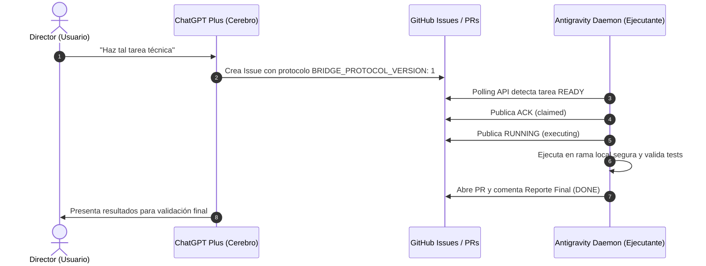

# Inverse Bridge Daemon (`/inv_chatgpt`)

Plano de control Machine-to-Machine (M2M) seguro y auditable entre **ChatGPT Plus** (Cerebro) y **Antigravity** (Ejecutante local) mediante GitHub Issues y Pull Requests.

---

## 🏛️ Arquitectura



---

## 🔒 Reglas de Seguridad Blindadas

1. **Redacción de Secretos:** Todo token (`ANTIGRAVITY_GITHUB_TOKEN`, `ghp_*`, `github_pat_*`), cookies, contraseñas o claves es redactado automáticamente antes de registrar logs o publicar reportes.
2. **Restricción de Rutas (`allowed_roots`):** Solo se permite el acceso a las rutas explícitamente autorizadas en `config.json`.
3. **Bloqueo de Operaciones Destructivas:** Cualquier comando de borrado recursivo o formateo es bloqueado salvo bandera `DESTRUCTIVE_APPROVED: true`.
4. **No Direct Push a `main`:** Todo cambio de código se realiza en una rama dedicada `bridge/...` y se propone vía Pull Request.
5. **Deduplicación e Idempotencia:** Las tareas procesadas se persisten en `state.json` para evitar ejecuciones duplicadas tras reinicios.

---

## 🚀 Uso y Ejecución

### 1. Configurar Token de GitHub Localmente
En PowerShell:
```powershell
[Environment]::SetEnvironmentVariable("ANTIGRAVITY_GITHUB_TOKEN", "tu_token_aqui", "User")
```

### 2. Ejecutar Pruebas
```powershell
python test_bridge.py
```

### 3. Iniciar el Demonio
```powershell
python inverse_bridge_daemon.py
```
O en modo una sola pasada de comprobación:
```powershell
python inverse_bridge_daemon.py --once
```
